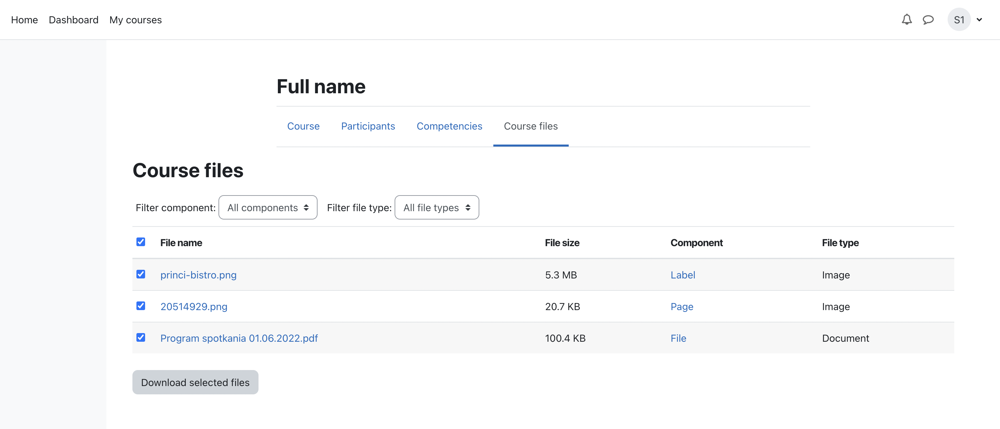

# Course files - Moodle local plugin

A simple Moodle local plugin that allows students
and other course participants to view, filter and download
the course files that are available to them.

Tested in: Moodle 4.0

## Quick install

Download zip package, extract to a folder and upload this folder
into `local` directory.

## Changelog

- Version 2022080600
  - Compatibility with Moodle 4.0
- Version 2022081200
  - Add plugin's own capabilities
  - Handle courses with no files
- Version 2022082400
  - Fix required Moodle version (3.5+)
  - Add link icon for Moodle 3.x

## About

Developed by: Kacper Rokicki <k.k.rokicki@gmail.com>

Based on "List course files" plugin: https://moodle.org/plugins/local_listcoursefiles

GIT: https://github.com/k-rokicki/moodle-local_coursefiles
